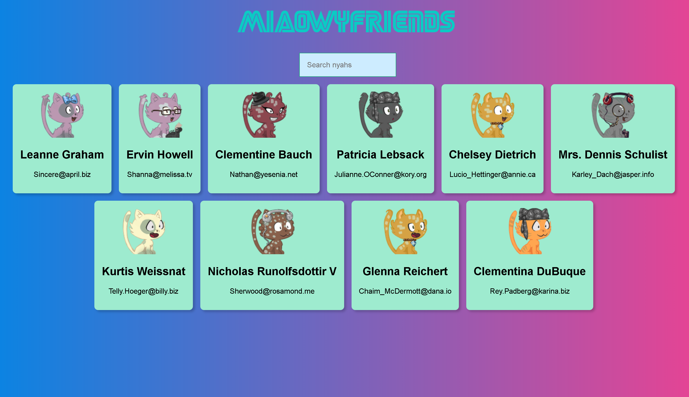
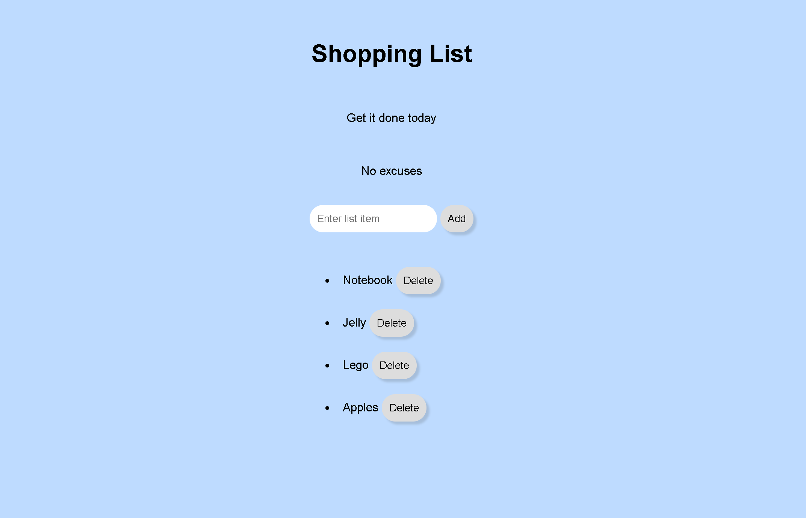
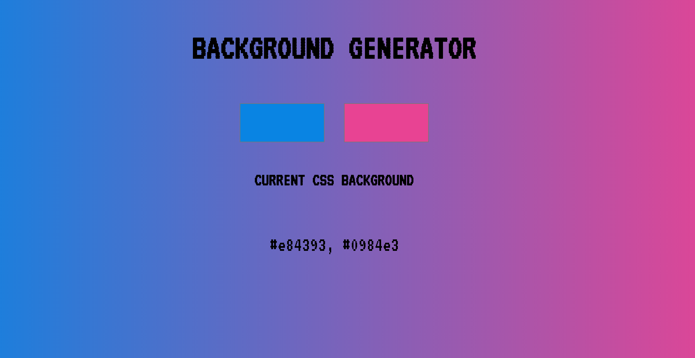

#Projects Completed in the course

A React app that fetches state from a json object and live-filters the result to show types of CATS.

A shopping list made by manipulating the DOM

An image gallery

A page for launching a product with a sign up option

A robot build with flexbox

A site to generate nice gradient backgrounds

